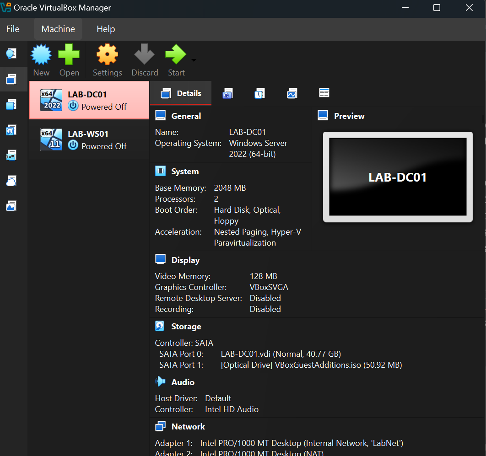
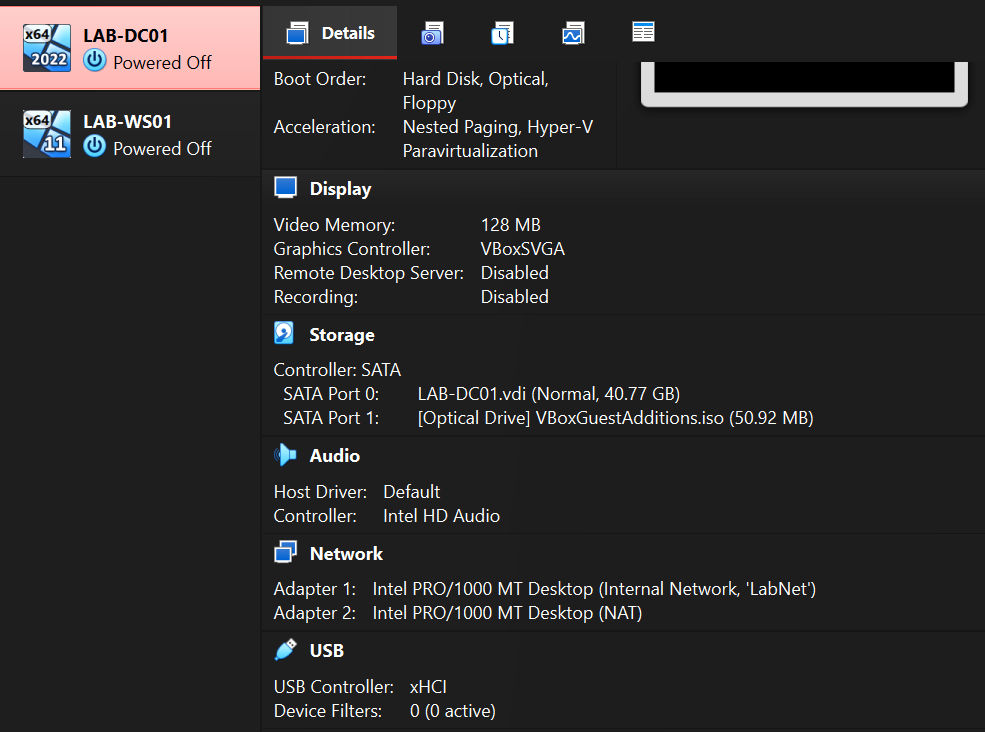
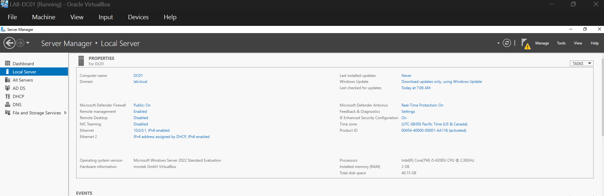
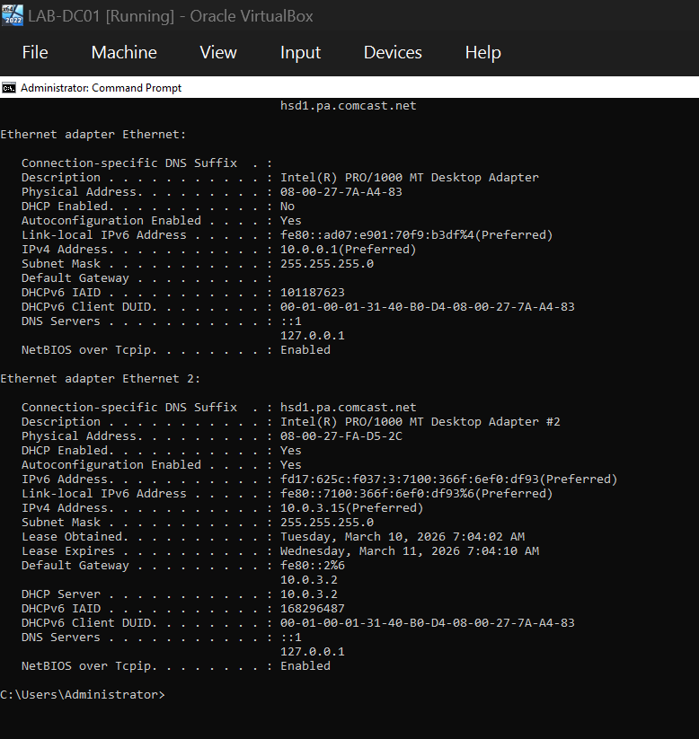
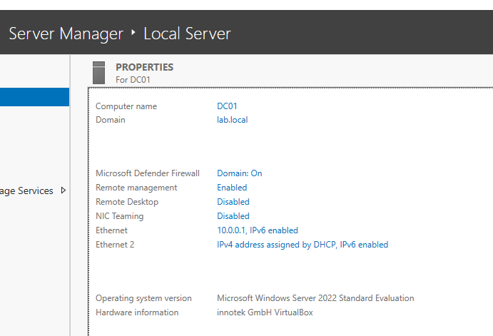

# homelab-helpdesk

Helpdesk Home Lab - Windows Server 2022 + Active Directory

## Overview

A home lab environment simulating a small corporate network built on an HP Elitebook using Oracle VirtualBox. The environment includes a Windows Server 2022 Domain Controller running Active Directory, DNS, and DHCP, with a Windows 11 workstation joined to the domain. Built for hands-on practice with the tasks I'd be doing daily at a Tier 1 helpdesk or MSP role.

## Architecture

```text
┌─────────────────────────────────────────────────────┐
│                  HP Elitebook 840 G3 (Host)         │
│                                                     │
│  ┌──────────────────┐     ┌──────────────────┐      │
│  │    LAB-DC01      │     │    LAB-WS01      │      │
│  │  Win Server 2022 │     │   Windows 11     │      │
│  │                  │     │                  │      │
│  │  AD DS / DNS /   │     │  Domain-joined   │      │
│  │  DHCP            │     │  client          │      │
│  │                  │     │                  │      │
│  │  IP: 10.0.0.1    │◄───►│  IP: DHCP        │      │
│  │  (static)        │     │  (10.0.0.100-200)│      │
│  └──────────────────┘     └──────────────────┘      │
│           ▲                        ▲                │
│           └────────────────────────┘                │
│                 Internal Network                    │
│                    "LabNet"                         │
└─────────────────────────────────────────────────────┘
```
Environment Details
| Component | Details |
| :--- | :--- |
| **Hypervisor** | Oracle VirtualBox on Windows 11 |
| **Domain Controller (DC01)** | Windows Server 2022 Standard, 2 GB RAM, 40 GB disk |
| **Workstation (WS01)** | Windows 11 Enterprise, 2 GB RAM, 25 GB disk |
| **Domain** | lab.local |
| **Network** | 10.0.0.0/24 (Internal Network "LabNet") |
| **DHCP Scope** | 10.0.0.100–200, gateway and DNS → 10.0.0.1 |


What I Built - VirtualBox & Networking

Set up two VMs on an isolated internal network. DC01 has a second NAT adapter for internet access. WS01 only communicates through the internal network, getting all its settings from the server via DHCP - same as a real corporate workstation.





Windows Server - Static IP & Naming

Configured DC01 with a static IP of 10.0.0.1, DNS pointing to 127.0.0.1 (itself, since it becomes the DNS server), and renamed the machine to DC01 following standard enterprise naming conventions.






